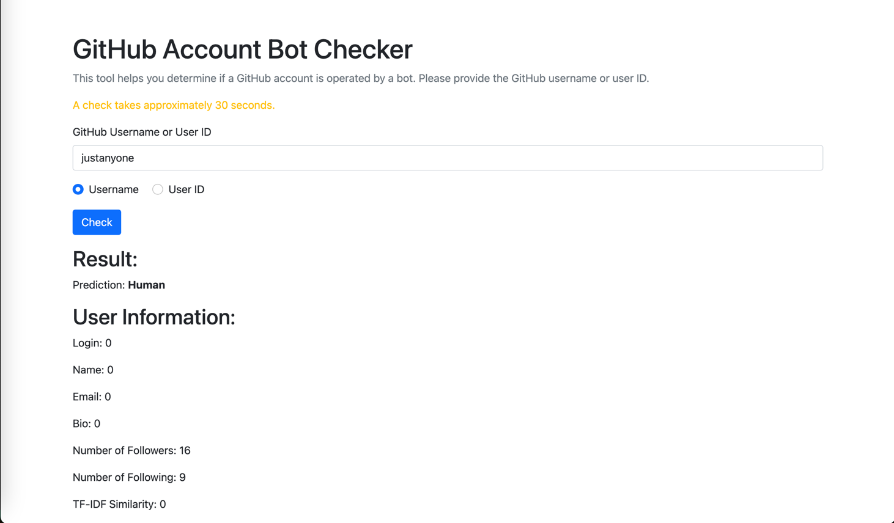

# Bot Hawk: OSS Robot Account Identification
## Description
Bot Hawk is a project designed to identify robot accounts in open-source software (OSS) repositories. The project is implemented using Python and Flask, making it easy to set up and run on any system.
Directory Structure



The project directory is organized as follows:

- `app/`: Contains the main application code, including routes, models, and views.
- `training/`: Holds scripts and data for training the models used to identify robot accounts. For detailed instructions on the training methods, please refer to the [`training/README.md`](training/README.md) file.

## How to Use

### Clone the Repository and Install Requirements
```shell
git clone https://github.com/justanyone2023/bothawk_flask.git  # Download the source code
cd bothawk_flask  # Navigate to the project directory
pip install -r requirements.txt  # Install required packages
```
### Initialize and Run the Project

Depending on your operating system, use one of the following commands to set the FLASK_APP environment variable:
- Linux:
```shell
export FLASK_APP=manage.py
```
- Windows (CMD):
```shell
set FLASK_APP=manage.py
```
- Windows (PowerShell):
```shell
$env:FLASK_APP = "manage"
```
Then, run the following commands to initialize the database, perform migrations, and start the server:
```shell
flask db init  # Initialize the database
flask db migrate  # Apply migrations
flask db upgrade  # Upgrade the database schema
flask run  # Start the server
```
After running the above command, you should see the following output:
```shell
[root@centos bothawk_flask]# python manage.py runserver
 * Running on http://127.0.0.1:5000/ (Press CTRL+C to quit)
 * Restarting with stat
 * Debugger is active!
 * Debugger PIN: 128-717-467
```
Access the Application

Open your web browser and navigate to http://127.0.0.1:5000 to access the application.

## RESTful Interfaces
### User Endpoint

URL
```agsl
/user
```
Method
- GET: Submit user data as query parameters.
- POST: Submit user data as a JSON payload.

Example Request
```agsl
GET /user?account=justanyone&accountType=username
```
Response

Returns a JSON object with the task submission status and a task ID.
```json
{
  "success": True,
  "message": "Task submitted",
  "task_id": "your-task-id"
}
```
### Task Endpoint
URL
```agsl
/task/<task_id>
```

Method
- GET: Retrieve the status of a task.

Example Request
```agsl
GET /task/{task_id}
```
Response
```json
{
  "status": "in progress",
  "progress": 50,
  "data": "user data",
  "prediction_list": ["prediction1", "prediction2"]
}
```


